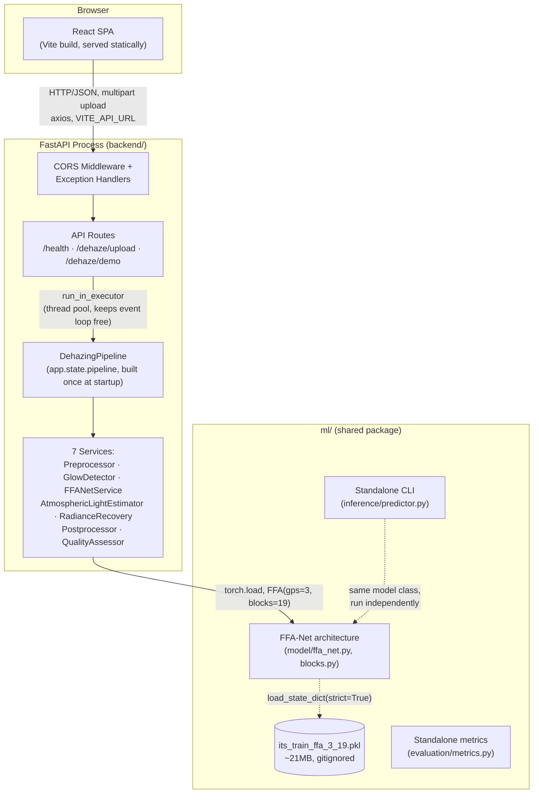
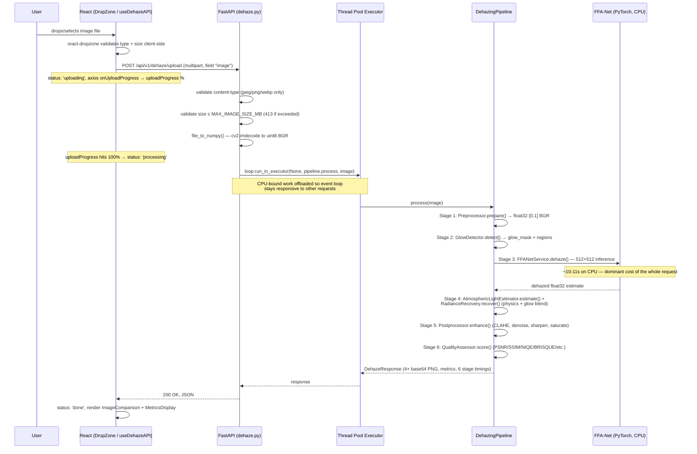
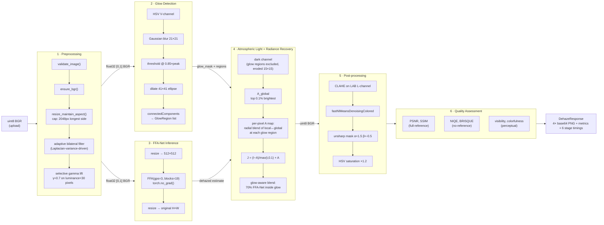
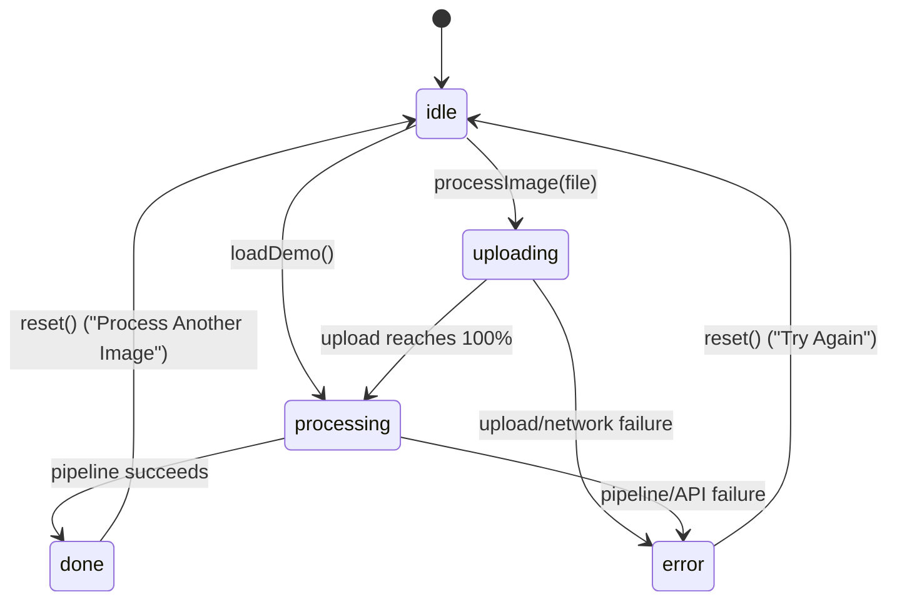
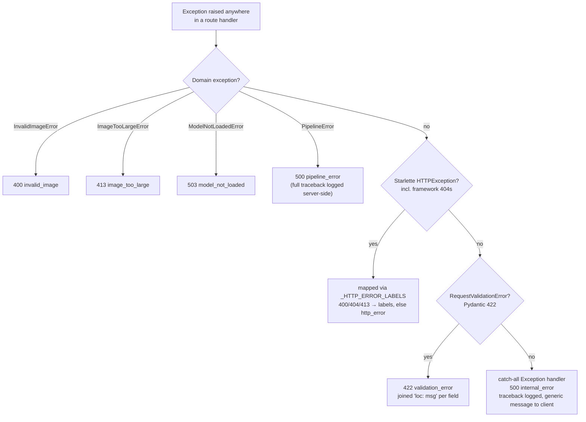

<div align="center">

# NightHaze

**A hybrid deep-learning + physics-based system for removing haze from nighttime photographs.**

Daytime dehazing algorithms assume one light source (the sun) and a globally
constant atmospheric light. Nighttime scenes break both assumptions — light
comes from many independent sources (sodium lamps, neon signs, headlights,
LEDs), each with its own color and intensity, surrounded by visible glow
halos that classical dehazing misreads as scene content.

NightHaze combines a pretrained attention-based CNN (**FFA-Net**, AAAI 2020)
with an explicit atmospheric-scattering model that estimates illumination
**per light source** rather than globally, then blends the two based on
where each is more trustworthy.

**Final Year B.Tech CSE Project**

Author: **Sohom Banerjee** · [GitHub](https://github.com/Srap47) · [LinkedIn](https://www.linkedin.com/in/sohom-banerjee-863775225/) · sohommister@gmail.com

[Architecture](docs/architecture.md) ·
[API Reference](docs/api_reference.md) ·
[Model Info](docs/model_info.md) ·
[ML Tools](ml/README.md)

</div>

---

## Table of Contents

1. [Project Overview](#1-project-overview)
2. [Architecture Overview](#2-architecture-overview)
3. [Detailed Folder & File Structure](#3-detailed-folder--file-structure)
4. [Service Architecture (Module Boundaries)](#4-service-architecture-module-boundaries)
5. [API Documentation](#5-api-documentation)
6. [Data & Persistence](#6-data--persistence)
7. [Development & Deployment](#7-development--deployment)
8. [Engineering Standards](#8-engineering-standards)
9. [Tech Stack](#9-tech-stack)
10. [Citation](#10-citation)

---

## 1. Project Overview

### What it actually does

A user submits a nighttime photograph (upload or the bundled demo image).
The backend runs it through a **six-stage synchronous pipeline** that:

1. Validates and conditions the raw image (denoise, gamma-lift shadows).
2. Detects artificial light sources and their glow halos using classical CV
   (no ML — HSV thresholding + connected components).
3. Runs the image through **FFA-Net**, a pretrained feature-fusion attention
   network, producing a deep-learning dehazed estimate.
4. Estimates atmospheric light **per light source** (not globally) and
   inverts the atmospheric scattering equation to recover scene radiance,
   blending 70% back toward the FFA-Net output inside glow regions where the
   physics becomes numerically unstable.
5. Polishes the result — CLAHE local contrast, denoising, unsharp masking,
   saturation boost.
6. Scores the result against the input with six quantitative metrics (PSNR,
   SSIM, NIQE, BRISQUE, visibility, colorfulness).

The API returns **four images** (original, dehazed, transmission map, glow
mask) plus the metrics and a per-stage timing breakdown, all in one JSON
response. The frontend renders this as a draggable before/after comparison
slider with animated metric cards.

### Business domain & use case

This is a **computational photography / low-light image enhancement**
project, not a data-driven SaaS product. There are no user accounts, no
persisted history, and no multi-tenant concerns — every request is
independent and stateless. The problem being solved is a genuine open gap in
the dehazing literature: virtually all published dehazing methods (and their
public pretrained weights) target **daytime, single-illuminant** scenes,
because that is what the standard benchmark, RESIDE, contains. Nighttime
imagery — surveillance footage, dashcams, low-light photography — is
systematically underserved. NightHaze's core engineering contribution is
adapting a daytime-trained model to this domain without retraining it,
by handling the night-specific parts of the problem (multiple illuminants,
glow) with an explicit physical model rather than expecting the network to
have learned something it was never trained on.

### Primary workflows

- **Upload workflow**: user drags/drops or selects an image → `POST
  /api/v1/dehaze/upload` → full pipeline runs (~12–15s on CPU) → result
  rendered with tabs for Result / Transmission Map / Glow Mask.
- **Demo workflow**: user clicks "Try with Demo Image" → `GET
  /api/v1/dehaze/demo` → same pipeline runs against a bundled fixture image,
  no upload required. Exists specifically so the capability can be
  demonstrated (e.g. in a viva/defense) without depending on having a good
  sample image on hand.
- **Health workflow**: on every page load, the frontend `Header` polls `GET
  /api/v1/health` to show a live status dot (model ready / model missing /
  API offline), so degraded states are visible immediately rather than only
  surfacing as a failed upload.

---

## 2. Architecture Overview

### System design

NightHaze is a **two-application system with a shared library**, not a
microservices architecture — there is exactly one backend process, one
frontend build, and no message broker, database, or service mesh between
them. The three top-level units are:

| Unit | Type | Responsibility |
| --- | --- | --- |
| `backend/` | FastAPI process (Python) | HTTP API, request validation, pipeline orchestration, all business logic |
| `frontend/` | React SPA (TypeScript, static build) | UI, calls the backend over HTTP/JSON, no server-side logic |
| `ml/` | Shared Python package (no framework deps) | Model architecture + weights + standalone CLI/metrics, importable by the backend *and* independently from the command line |

The backend imports `ml.model.ffa_net.FFA` at runtime (see
[`ffa_net_service.py`](backend/app/services/ffa_net_service.py)) by adding
the project root to `sys.path`, rather than the `ml/` package being
installed or vendored — this keeps `ml/` genuinely standalone (the CLI in
`ml/inference/predictor.py` runs with zero backend dependencies) while still
letting the API reuse the exact same model code and weights.



### Request lifecycle: `POST /api/v1/dehaze/upload`

This is the critical path, so it's worth tracing in full — from browser drop
to rendered comparison slider.



**Why the thread-pool offload matters**: FastAPI's route handler is `async`,
but `DehazingPipeline.process()` is fully synchronous CPU-bound code (OpenCV,
NumPy, PyTorch CPU inference). Calling it directly inside an `async def`
route would block the single-threaded event loop for the entire ~12–15s
pipeline run, freezing `/health` and any concurrent request. `_run_pipeline()`
in [`dehaze.py`](backend/app/api/routes/dehaze.py) hands the call to
`loop.run_in_executor(None, ...)` — the default `ThreadPoolExecutor` — so the
event loop remains free.

### Pipeline data flow (the six stages)



### Frontend state machine

The entire UI is driven by one hook, [`useDehazeAPI`](frontend/src/hooks/useDehazeAPI.ts),
which exposes a single `status` value that [`HomePage`](frontend/src/pages/HomePage.tsx)
switches on to decide what to render — there is no router-level state, no
Redux/Zustand store, and no prop-drilled loading flags scattered across
components.



Each state maps to a distinct render branch in `HomePage` — idle (hero +
DropZone + demo button + feature cards), uploading (progress bar driven by
axios `onUploadProgress`), processing (`PipelineProgress` stepper — a purely
cosmetic animation, since the backend does not stream per-stage progress),
done (tabbed `ImageComparison` / transmission map / glow mask +
`MetricsDisplay`), error (message + retry).

---

## 3. Detailed Folder & File Structure

```
nighthaze/
├── backend/                       FastAPI application (the only stateful process)
│   ├── app/
│   │   ├── main.py                 FastAPI app instance, lifespan, CORS, ALL exception handlers
│   │   ├── config.py                Settings (pydantic-settings) — every tunable in one place
│   │   ├── dependencies.py          (reserved — currently empty; no FastAPI Depends() wiring yet)
│   │   ├── api/
│   │   │   ├── router.py            Composes health + dehaze routers under /api/v1
│   │   │   └── routes/
│   │   │       ├── health.py        GET /health
│   │   │       └── dehaze.py        POST /upload, GET /demo — the only two business endpoints
│   │   ├── core/
│   │   │   ├── pipeline.py          DehazingPipeline — orchestrates all 7 services, stage timing
│   │   │   ├── exceptions.py        Domain exception hierarchy (NightHazeError + 4 subclasses)
│   │   │   └── logging.py           setup_logging() — one call at startup
│   │   ├── models/
│   │   │   └── schemas.py           Every Pydantic request/response shape (the API's JSON contract)
│   │   └── services/                One file per pipeline stage — see §4
│   └── tests/                       31 pytest tests, mirrors services/ 1:1 + API + full pipeline
│
├── ml/                             Framework-agnostic model package — importable standalone
│   ├── model/
│   │   ├── blocks.py                 PALayer, CALayer, Block, Group — architecture primitives
│   │   └── ffa_net.py                 FFA class — must match the official repo exactly (see below)
│   ├── inference/
│   │   └── predictor.py               CLI: dehaze one image with zero backend/FastAPI dependency
│   ├── evaluation/
│   │   └── metrics.py                 compute_psnr/ssim/colorfulness/niqe_simplified — standalone
│   └── weights/
│       └── its_train_ffa_3_19.pkl     gitignored (~21MB) — downloaded separately, see docs/model_info.md
│
├── frontend/                        React 19 + TypeScript SPA (Vite build)
│   └── src/
│       ├── types/index.ts             TypeScript mirror of backend Pydantic schemas
│       ├── services/api.ts            Typed axios client — the ONLY place HTTP calls are made
│       ├── hooks/useDehazeAPI.ts       The entire app's state machine, in one hook
│       ├── utils/formatters.ts         Number formatting + METRIC_CONFIGS (thresholds, labels)
│       ├── components/
│       │   ├── ui/                    Button, Card, Badge, Spinner — zero business logic, pure style
│       │   ├── uploader/DropZone.tsx  react-dropzone wrapper, client-side validation
│       │   ├── layout/                Header (health polling), Layout (page chrome)
│       │   ├── pipeline/              PipelineProgress (processing-state animation)
│       │   └── viewer/                ImageComparison (Pointer Events drag slider),
│       │                               MetricsDisplay (animated metric cards + stage bar chart)
│       └── pages/                     HomePage (the state machine's view), AboutPage (static)
│
└── docs/                            Deep-dive docs referenced from this README
    ├── architecture.md                Full stage-by-stage + physics derivation
    ├── api_reference.md               Every endpoint, every error code, full examples
    └── model_info.md                  FFA-Net internals, checkpoint format, citation
```

### Why this structure, specifically

**`ml/` is deliberately outside `backend/`.** This is the single most
important structural decision in the repo. The model architecture, its
pretrained weights, a CLI, and standalone metric functions are all things a
grader, researcher, or future maintainer might want to use *without* running
a FastAPI server — `ml/inference/predictor.py --input photo.jpg` works from a
bare Python environment with just `torch`, `opencv-python`, and `numpy`. If
the model lived inside `backend/app/`, it would be entangled with FastAPI,
Pydantic, and the rest of the web stack for no reason. The backend reaches
into `ml/` (via a `sys.path` insert in `ffa_net_service.py`, resolving three
parents up from the service file to the project root) rather than the
reverse — `ml/` has zero imports from `backend/`, so the dependency arrow
only ever points one way.

**One service file per pipeline stage, all under `backend/app/services/`.**
Each service (`Preprocessor`, `GlowDetector`, `AtmosphericLightEstimator`,
`RadianceRecovery`, `Postprocessor`, `FFANetService`, `QualityAssessor`) is a
small class taking `Settings` in its constructor and exposing one public
method that does exactly one pipeline stage's work. This mirrors the
six-stage pipeline 1:1 (glow detection and atmospheric light are split into
two services because they have genuinely separate concerns — detecting *where*
the lights are vs. estimating *what color/intensity* the ambient light is
— even though both feed stage 4). `DehazingPipeline` in `core/pipeline.py`
is the only place that knows the stage *order*; no service calls another
service directly, so stages can be tested (and reasoned about) in complete
isolation — which is exactly what `backend/tests/test_preprocessor.py`,
`test_glow_detector.py`, and `test_ffa_net_service.py` do.

**`core/` vs `services/` vs `models/` boundary.** `models/schemas.py` holds
*only* Pydantic shapes — no logic. `services/` holds *only* logic — no
FastAPI/Pydantic imports except where a service's constructor takes
`Settings`. `core/` holds the two things that don't fit either bucket:
cross-cutting orchestration (`pipeline.py`, which depends on every service)
and infrastructure (`exceptions.py`, `logging.py`). This means you can read
`schemas.py` top-to-bottom to understand the entire API contract without
touching business logic, and read one `services/*.py` file to understand one
pipeline stage without needing FastAPI knowledge at all.

**Frontend: `services/api.ts` is the only file that imports axios.** Every
other file that needs backend data goes through `useDehazeAPI`, which itself
only calls functions from `api.ts`. This means swapping HTTP libraries, or
adding request interceptors/auth headers in the future, touches exactly one
file. `types/index.ts` is hand-mirrored from `backend/app/models/schemas.py`
rather than generated — there is no OpenAPI codegen step in this project
(a reasonable place to add one if the schemas start drifting).

**No `shared/` or `common/` package.** Deliberately: the "shared" surface
between frontend and backend is the JSON wire format (documented in
`docs/api_reference.md`) and the `ml/` package (used by backend + CLI, not
by the frontend at all, which never touches Python). There was no felt need
for a third shared-code location.

---

## 4. Service Architecture (Module Boundaries)

**This is not a microservices system.** There is one deployable backend
process and one static frontend bundle; the term "service" below refers to
Python *classes* (`backend/app/services/*.py`) that partition the pipeline's
logic, not independently deployable network services. There is no service
mesh, no inter-process RPC, no message broker, and no per-service database —
all seven "services" run in-process, in the same Python interpreter, called
sequentially by `DehazingPipeline.process()`.

| Service | File | Responsibility | Depends on |
| --- | --- | --- | --- |
| `Preprocessor` | `preprocessor.py` | Validate, resize, denoise, gamma-lift | `image_utils` |
| `GlowDetector` | `glow_detector.py` | Locate light sources + halos (pure CV) | `image_utils` |
| `FFANetService` | `ffa_net_service.py` | Load + run the pretrained model | `ml.model.ffa_net.FFA` |
| `AtmosphericLightEstimator` | `atm_light.py` | Per-region atmospheric light map | `glow_detector.GlowRegion`, `image_utils` |
| `RadianceRecovery` | `radiance_recovery.py` | Invert the scattering equation | `atm_light.AtmLightResult`, `image_utils` |
| `Postprocessor` | `postprocessor.py` | CLAHE, denoise, sharpen, saturate | — |
| `QualityAssessor` | `quality_assessor.py` | PSNR/SSIM/NIQE/BRISQUE/etc. | `skimage.metrics`, `brisque` |

Each is instantiated exactly once, in `DehazingPipeline.__init__`, and
reused for the process's entire lifetime (built once at FastAPI startup via
the `lifespan` context manager in `main.py`, stored on `app.state.pipeline`).
This matters for `FFANetService` specifically: loading the ~21MB checkpoint
and constructing the PyTorch module is the single most expensive
initialization in the app, so doing it per-request would make every upload
pay a multi-second model-load tax on top of inference.

**Graceful degradation is a first-class design constraint, not an
afterthought.** `FFANetService.__init__` wraps its own loading logic in a
`try/except Exception` — if the weights file is missing or corrupt, the
*constructor does not raise*. Instead `model_loaded` is set to `False`,
`/health` reports it truthfully, and `dehaze()` raises `ModelNotLoadedError`
(→ HTTP 503) only if and when someone actually tries to use it. This means
the entire application — including the frontend, the health check, and every
non-dehazing route — stays fully operational even with zero model weights
present, which is exactly the state a fresh `git clone` is in (the weights
are gitignored; see §7).

---

## 5. API Documentation

Full request/response examples with real payloads live in
[`docs/api_reference.md`](docs/api_reference.md) — this section covers
structural patterns that apply across all endpoints.

### Routes

| Method | Path | Purpose |
| --- | --- | --- |
| `GET` | `/` | Liveness/welcome message |
| `GET` | `/api/v1/health` | Model readiness + device info |
| `POST` | `/api/v1/dehaze/upload` | Dehaze a user-uploaded image (multipart) |
| `GET` | `/api/v1/dehaze/demo` | Dehaze the bundled sample image |

Routing is composed in two layers: `api/router.py` mounts `health.router`
and `dehaze.router` (the latter under an internal `/dehaze` prefix), and
`main.py` mounts the combined `api_router` under `/api/v1`. This is the only
indirection in the routing — there's no dynamic route discovery or plugin
system, by design, since the API surface is intentionally small and fixed.

### Middleware

Exactly one middleware is registered: `CORSMiddleware`, configured from
`settings.allowed_origins` (defaults to `localhost:5173` and `localhost:3000`
— the Vite and CRA-style dev ports). There is no authentication middleware,
rate limiting, or request logging middleware — see §6 for why (no
persistence layer, no user accounts, single-tenant academic deployment).

### Validation flow

Validation happens in layers, deliberately front-loaded to fail fast before
any CPU-expensive work starts:

1. **Content-Type whitelist** (`dehaze.py`) — rejects anything outside
   `image/jpeg`, `image/png`, `image/webp` with `400` before the file body
   is even fully read.
2. **Size check** (`dehaze.py`) — compares `len(file_bytes)` against
   `settings.max_image_size_mb` and raises `413` before decoding.
3. **Decode check** (`image_utils.file_to_numpy`) — `cv2.imdecode` failure
   (corrupt/non-image bytes that slipped past the MIME check) raises
   `InvalidImageError` → `400`.
4. **Dimension check** (`image_utils.validate_image`, called inside
   `Preprocessor.prepare`) — rejects images below `min_image_dimension`
   (64px). Note this is a *floor*, not a ceiling: oversized images are
   **not** rejected here — they're transparently downscaled by
   `resize_maintain_aspect` in the same preprocessing step. This was a
   deliberate fix during development; an earlier version rejected any image
   over 2048px, which meant a completely ordinary 4032×3024 phone photo
   would 400 on upload. See the "processing cap, not a rejection" comment in
   `image_utils.validate_image`.

### Error handling structure

**Every possible failure — domain error, framework error, or unhandled
exception — is normalized to one JSON shape**, `ErrorResponse`:

```json
{ "success": false, "error": "<machine-readable code>", "detail": "<human-readable message>" }
```

This is enforced by five separate exception handlers in `main.py`, layered
from most to least specific:



The catch-all `Exception` handler is the security-relevant one: it logs the
full traceback via `logger.exception(...)` but returns only the string "An
unexpected error occurred." to the client — internal details (file paths,
stack frames, library versions) never leak into an HTTP response, even for
genuinely unanticipated bugs.

### Response shape

Both `/dehaze/upload` and `/dehaze/demo` return an identical
`DehazeResponse`: four base64 PNG data-URIs (`original_image_b64`,
`dehazed_image_b64`, `transmission_map_b64`, `glow_mask_b64`), a `metrics`
object (9 fields — see `DehazeMetrics` in `schemas.py`), and a
`pipeline_stages` array of exactly 6 `{stage, time_ms}` records in
fixed pipeline order. Encoding images as data-URIs rather than returning
URLs to a static file store is intentional: there is no file storage layer
in this system at all (§6), so the response is fully self-contained and the
frontend can bind it directly to `` with no follow-up request.

---

## 6. Data & Persistence

**There is no database in this system**, and none is planned. This is a
deliberate architectural choice, not a missing feature:

- Every request is **stateless and self-contained** — an image comes in, a
  result goes out, nothing is written to disk or retained in memory beyond
  the lifetime of that one request (aside from the pipeline object itself,
  which holds only the loaded model weights, not any request data).
- There are **no user accounts**, so there is nothing to key persisted data
  against.
- The only "storage" in the entire system is `ml/weights/its_train_ffa_3_19.pkl`
  (a static, read-only model checkpoint, gitignored and downloaded once) and
  `backend/tests/fixtures/sample_hazy_night.jpg` (the bundled demo image).

If this project grows a "history of past dehazes" feature, the natural
extension point is `DehazingPipeline.process()` in `core/pipeline.py` — it
already returns a fully-formed `DehazeResponse` keyed by a generated
`job_id` (currently discarded after the HTTP response is sent), which is
the natural persistence key.

---

## 7. Development & Deployment

### Prerequisites

Python 3.11, Node 18+, [uv](https://github.com/astral-sh/uv) (Python
package/venv manager — see `backend/pyproject.toml`'s `[tool.uv]` section,
which excludes the non-headless `opencv-python` that `brisque` would
otherwise pull in as a transitive dependency, avoiding a duplicate OpenCV
install).

### 1. Model weights (required before the app is fully functional)

```
ml/weights/its_train_ffa_3_19.pkl
```

Not committed to git (~21MB, gitignored via `ml/weights/*.pkl`). Download
from the official [zhilin007/FFA-Net](https://github.com/zhilin007/FFA-Net)
repository. **The app runs without it** — `/health` will report
`model_loaded: false` and dehazing endpoints will return `503` — see §4.

### 2. Backend

```bash
cd backend
uv venv --python 3.11
uv pip install -r requirements.txt

cp ../.env.example .env          # optional — defaults already match
.venv/Scripts/python.exe -m uvicorn app.main:app --port 8000
```

API on `http://localhost:8000`, interactive OpenAPI docs at `/docs`.

### 3. Frontend

```bash
cd frontend
npm install
npm run dev
```

UI on `http://localhost:5173`. `frontend/.env.development` sets
`VITE_API_URL=http://localhost:8000`; change this (or add
`.env.production`) to point at a different backend host.

### 4. Verify

```bash
curl http://localhost:8000/api/v1/health
```

> **First real request is slow by design.** FFA-Net inference on CPU takes
> ~10–11s, so a full upload-to-result round trip is ~12–15s. This is
> expected — not a hang. There is no GPU-accelerated path configured in this
> repo, though `settings.device` and `DEVICE` in `.env` accept `"cuda"` if a
> CUDA-capable PyTorch install is present.

### Environment variables

| Variable | Default | Effect |
| --- | --- | --- |
| `DEBUG` | `false` | DEBUG-level logging when true |
| `MODEL_WEIGHTS_PATH` | `../ml/weights/its_train_ffa_3_19.pkl` | Resolved relative to `backend/` |
| `DEVICE` | `cpu` | `cpu` or `cuda` |
| `MAX_IMAGE_SIZE_MB` | `10` | Upload size ceiling (413 above this) |

(Full parameter list, including physics and post-processing tunables not
exposed via env vars, is documented inline in `backend/app/config.py` with
`TWEAK NOTE` comments explaining the effect of each.)

### Tests

```bash
cd backend
uv pip install -r requirements-dev.txt
.venv/Scripts/python.exe -m pytest tests/ -v            # all 31 tests, ~70s
.venv/Scripts/python.exe -m pytest tests/ -v -m "not slow"   # skip full-pipeline tests
```

### Build pipeline

Frontend build is `tsc -b && vite build` (type-check then bundle — a failed
type-check blocks the build, there's no "build with warnings" path). Backend
has no build step; it runs directly from source via `uvicorn`.

### Deployment / CI / Docker

**None of these exist in this repository at present** — there is no
`Dockerfile`, `docker-compose.yml`, `.github/workflows/`, or any other CI/CD
configuration. This is an academic project run and evaluated locally / via
direct demo rather than deployed to a hosted environment. If containerizing,
the natural split is one image for `backend/` (Python 3.11 + the `uv`-managed
venv + `ml/weights/`) and a static build of `frontend/dist/` served via any
static file host or reverse-proxied alongside the API.

---

## 8. Engineering Standards

### Coding conventions

- **Backend**: `black` (line-length 88) + `isort` (black-profile), configured
  in `backend/pyproject.toml`. Every module has a docstring explaining its
  role in the pipeline and its I/O dtype contract (see below). Comments use
  `TWEAK NOTE:` markers wherever a value is meant to be tuned by a future
  developer (physics constants, filter kernel sizes, CLAHE parameters, etc.)
  — these are deliberately verbose so the "why would I change this" question
  is answered inline rather than requiring a trip to `docs/architecture.md`.
- **Frontend**: `oxlint` for linting (Rust-based, fast — see `npm run lint`),
  TypeScript strict mode. No Prettier config is present; formatting follows
  whatever the editor/oxlint defaults produce.

### The dtype/color contract (the single most important convention in the codebase)

> **All pipeline-internal images are `float32` BGR in `[0,1]`. `uint8` is
> used only at process I/O boundaries** (decoding an upload, encoding a
> response, or briefly inside a service that needs an OpenCV op that only
> accepts 8-bit input, like `cv2.fastNlMeansDenoisingColored`).

Every service module's docstring states its own input/output contract
explicitly (e.g. `radiance_recovery.py`: "INPUT = float32 [0,1] BGR ...
OUTPUT = uint8 BGR"), because a mismatch here is a silent-corruption class
of bug (a `uint8` array full of `0`/`1` instead of `0`/`255` doesn't error,
it just produces a black image). `app/services/image_utils.py` is the single
source of truth for the four conversion functions (`normalize`,
`denormalize`, `ensure_bgr`, `resize_maintain_aspect`) — no service
hand-rolls its own dtype conversion.

### Architecture patterns

- **Constructor dependency injection via `Settings`**: every service takes
  a `Settings` instance in `__init__` rather than importing the module-level
  `settings` singleton directly. This is what makes `backend/tests/conftest.py`
  able to build isolated services against a test `Settings()` instance
  without monkeypatching a global.
- **Dataclasses for internal results, Pydantic for API-facing schemas.** Each
  service returns a `@dataclass` (`PreprocessResult`, `GlowDetectionResult`,
  `AtmLightResult`) — plain, fast, no validation overhead, since these never
  cross a serialization boundary. Only `app/models/schemas.py` uses
  `BaseModel`, because those types are what FastAPI actually serializes to
  JSON and validates incoming requests against.
- **One orchestrator, zero inter-service calls.** No service imports another
  service's *class* to call it (they do import each other's dataclasses as
  type hints, e.g. `radiance_recovery.py` imports `AtmLightResult` from
  `atm_light.py`). `DehazingPipeline` is the only place stage order is
  encoded, which is what makes reordering, skipping, or swapping stages a
  one-file change.

### Error handling philosophy

Two rules, applied consistently: **(1) fail fast and cheap before failing
slow and expensive** (all upload validation happens before the 12s pipeline
run starts — see §5's validation-layer ordering), and **(2) never let an
unanticipated exception become an unhandled 500 with a leaked stack trace**
(the catch-all handler in `main.py` guarantees every response, even for bugs
nobody anticipated, is a well-formed `ErrorResponse` with a safe, generic
client-facing message and full details only in server logs).

### Testing strategy

- **Session-scoped expensive fixtures.** `backend/tests/conftest.py` scopes
  the `DehazingPipeline` and one full `pipeline_result` run as
  `session`-scoped pytest fixtures specifically because constructing FFA-Net
  and running CPU inference (~10-20s) is the dominant cost of the test
  suite — building it once and sharing the result across all pipeline-level
  tests (`test_pipeline.py`, several of `test_api.py`) turns what would be a
  10+ minute suite into ~70 seconds.
- **`@pytest.mark.slow` isolates the expensive tests** so `pytest -m "not slow"`
  gives a fast feedback loop (unit tests for `Preprocessor`, `GlowDetector`,
  and error-path API tests) during iteration, while the full marker-free run
  still exercises the real model end-to-end before anything ships.
- **Graceful-degradation is itself tested**: `test_ffa_net_service.py`
  explicitly constructs a service with a `model_weights_path` pointing at a
  nonexistent file and asserts the constructor does *not* raise, `model_loaded`
  is `False`, and `dehaze()` raises `ModelNotLoadedError` only when called —
  i.e. the degraded-mode behavior described in §4 is a tested contract, not
  just a docstring claim.
- **31 tests total**: 8 full-pipeline integration tests, 6 preprocessor unit
  tests, 5 glow-detector unit tests, 4 FFA-Net service tests, 8 API-layer
  tests (status codes, error envelopes, MIME/size validation).

---

## 9. Tech Stack

| Layer | Technology | Why |
| --- | --- | --- |
| **Model** | PyTorch 2.1 (CPU build) | FFA-Net inference; CPU-only keeps the dev/eval environment dependency-light |
| | FFA-Net (AAAI 2020) | Pretrained attention-based dehazing backbone, 4.46M params |
| **Backend** | FastAPI 0.110 | Async routing, automatic OpenAPI docs, Pydantic-native validation |
| | Pydantic 2 / pydantic-settings | Typed config (`Settings`) + typed API schemas |
| | OpenCV (headless) | All classical CV: glow detection, CLAHE, denoising, color conversions |
| | NumPy / SciPy / scikit-image | Array math, PSNR/SSIM implementations |
| | brisque | No-reference quality scoring (with a scipy-compat shim — see below) |
| | uvicorn | ASGI server |
| **Frontend** | React 19 + TypeScript | UI, strict typing mirrored against backend schemas |
| | Vite 8 | Dev server + build (`tsc -b && vite build`) |
| | Tailwind CSS 3 | Utility-first styling, custom theme (`night`/`primary`/`accent` colors) |
| | axios | Typed HTTP client with upload progress events |
| | react-router-dom 7 | Two-route client-side routing (`/`, `/about`) |
| | react-dropzone | Drag/drop upload with client-side MIME/size validation |
| | lucide-react | Icon set |
| **Tooling** | uv | Python venv + dependency management, with an override to dedupe OpenCV |
| | pytest / pytest-asyncio / pytest-cov | 31 backend tests |
| | black / isort | Python formatting |
| | oxlint | Frontend linting |

### A note on the BRISQUE dependency

`brisque==0.0.15` references `scipy.ndarray`, an alias SciPy removed in a
later release than the one this project pins against for other reasons.
`quality_assessor.py` works around this with a compatibility shim
(`scipy.ndarray = numpy.ndarray` before importing `brisque`) rather than
pinning an older SciPy globally, which would have constrained
`scikit-image`. If BRISQUE scoring still fails for any other reason at
runtime, it's caught and the metric reports `-1.0` (surfaced in the frontend
as an "unavailable" badge, not a crash) — see `BRISQUE_UNAVAILABLE` in
`frontend/src/utils/formatters.ts`.

---

## 10. Citation

The FFA-Net architecture in [`ml/model/`](ml/model/) is reproduced from the
official implementation **unmodified**, so the authors' released weights
load with `strict=True` and zero key mismatches.

> Qin, X., Wang, Z., Bai, Y., Xie, X., & Jia, H. (2020). FFA-Net: Feature
> Fusion Attention Network for Single Image Dehazing. *Proceedings of the
> AAAI Conference on Artificial Intelligence*, 34(07), 11908–11915.

```bibtex
@inproceedings{qin2020ffa,
  title     = {FFA-Net: Feature Fusion Attention Network for Single Image Dehazing},
  author    = {Qin, Xu and Wang, Zhilin and Bai, Yuanchao and Xie, Xiaodong and Jia, Huizhu},
  booktitle = {Proceedings of the AAAI Conference on Artificial Intelligence},
  volume    = {34},
  number    = {07},
  pages     = {11908--11915},
  year      = {2020}
}
```

Atmospheric scattering model: He, K., Sun, J., & Tang, X. (2011). *Single
Image Haze Removal Using Dark Channel Prior.* IEEE TPAMI, 33(12), 2341–2353.

---

<div align="center">

**Sohom Banerjee**
Final Year B.Tech CSE

[GitHub @Srap47](https://github.com/Srap47) · [LinkedIn](https://www.linkedin.com/in/sohom-banerjee-863775225/) · sohommister@gmail.com

</div>
